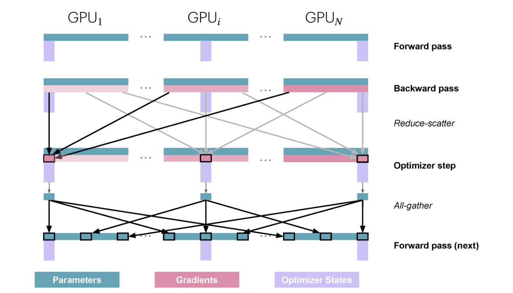
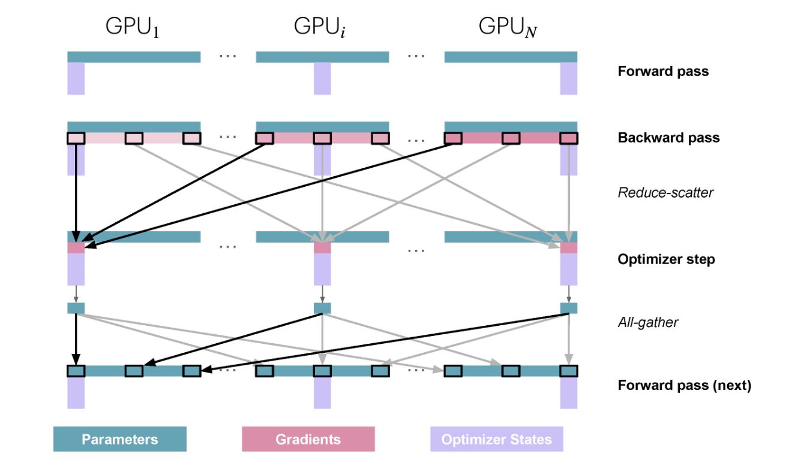
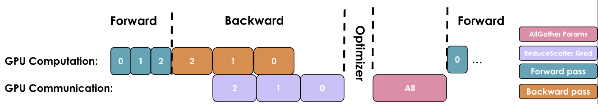

# Parallelisms
## Background 
This is the cheatsheet of LLM book https://huggingface.co/spaces/nanotron/ultrascale-playbook?section=high-level_overview. I will pick up everything that is useful and non-trivial to me at this time from the book.


## Memory usage in transformers

### Profiler (I cannot understand it)
This tool will be useful to understand and validate how communications between GPUs and compute are happening and where the bottlenecks are. 
```python
with torch.profiler.profile(
    activities=[
        torch.profiler.ProfilerActivity.CPU,
        torch.profiler.ProfilerActivity.CUDA,
    ],
    schedule=torch.profiler.schedule(wait=1, warmup=1, active=3),
    on_trace_ready=torch.profiler.tensorboard_trace_handler('./log/profile'),
    with_stack=True
) as prof:
    for step in range(steps):
        train_step() 
        prof.step()
```
Understanding the patterns is **crucial for optimizing distributed training performance**. For example, the trace will clearly show if gradient synchronization is properly overlapped with backward computation.


### Introduction
When training a neural network model, we store several items in memory:
+ Model weights
+ Model gradients
+ Optimizer states
+ Activations needed to compute the gradients

> **Note:** We could not compute the memory requirements for a model exactly, b/c kernels typically require some GPU memory and some memory is used for buffers and intermediate results that can't be used due to fragmentation.

### Memory usage in detail
Using the PyTorch profiler, we can understand how memory is allocated throughout training. We can see that memory utilization is not a static thing, but varies widely during training and during a training step:

 

First the activations increase quickly as we do the forward pass, then during the backward pass the gradients build up, and as the backward pass propagates, the stored activations used to compute the gradients **are progressively cleared**. Finally, we perform optimization, during which we need all the gradients, and then update the optimizer states before we start the next forward pass.

The first step looks different: the activations increase quickly and then plateau for a while. Why? In this first step, the PyTorch **caching allocator** does a lot of prep work, preparing memory allocations so that the subsequent steps don’t have to search for free memory blocks, which speeds them up ([see Zach’s blog](https://zdevito.github.io/2022/08/04/cuda-caching-allocator.html)). After the first step we also see the **optimizer states** appearing, which generally offset the memory usage for further training steps.

### FP32 and mixed precision training
In good old-fashioned full precision (**FP32**) training, both parameters and gradients require 4 bytes while the optimizer, if we use Adam, requires the momentum and variance to be stored, adding another 8 bytes per parameter (4 bytes each). In summary:

+ Model weights: 4N
+ Model gradients: 4N
+ Optimizer states: (4+4)N
+ Activations needed to compute the gradients: ?

The default nowadays for **mixed precision training** is to generally use **BF16** for most of the computations – requiring 2 bytes per parameter and gradient – as well as storing **an additional copy of the model weights and gradients** in FP32, making 12 bytes per parameter in total. In summary:

+ Model weights: (2+4)N
+ Model gradients: 2N
+ Optimizer states: (4+4)N
+ Activations needed to compute the gradients: ?

**Mixed precision training itself doesn’t save memory; it just distributes the memory differently across the three components**, and in fact adds another 4 bytes over full precision training if we accumulate gradients in FP32. It’s still advantageous, though, as computing the forward/backward passes in half precision:

> **Note:** (1) It allows us to use optimized lower precision operations on the GPU, which are faster and (2) reduces the activation memory requirements during the forward pass, which as we saw in the graph above is a large part of the memory usage. (在forward过程中产生的activation的精度更低, backward中的grad也更低)

### Activation recomputation

The general idea behind activation recomputation – also called gradient checkpointing or rematerialization – is to discard some activations during the forward pass to save memory and spend some extra compute to recompute these on the fly during the backward pass. Without recomputation, we store every hidden state between two learnable operations (e.g., feedforward, LayerNorm, etc.), so that we can use them during the backward pass to compute gradients. When we use recomputation, we typically only store activations at a few key points in the model architecture, discarding the rest of the activations and recomputing them on the fly during the **backward pass from the nearest saved activations**. Basically, we perform a sub-part of the forward pass again, to trade off memory for compute. There are a few strategies for selecting key activations to store:

+ Full: We checkpoint activations at the transition point between **each layer of the Transformer model**. This strategy saves the most memory but is the most expensive one in terms of compute. It typically increases the compute cost and time by up to **30-40%**.
+ Selective: The authors of the recomputation paper did a detailed analysis studying which activations grow the largest and have the cheapest recomputation cost in terms of FLOPS. It turns out that the **attention computations** fall in that category. For a GPT-3 (175B) model, this means a **70%** activation memory reduction at a **2.7%** compute cost.

> **Note:** Taking recomputation into account when calculating FLOPs for a training step gives a value called **"hardware FLOPs"**, which is the real number of operations performed on the accelerator. An alternative is to compute what is called model FLOPS utilization, which, in contrast to HFU, only takes into account the required operations for the forward and backward passes through the model and does not include recomputation in the measured FLOPs.

Most training frameworks these days use FlashAttention (covered further later in the book), which natively integrates activation recomputation in its optimization strategy by recomputing attention scores and matrices in the backward pass instead of storing them. Thus, most people using FlashAttention are already making use of selective recomputation.


### Gradient accumulation
In practice, the optimization step is conducted not on the sum but on the average of the gradients, so that the result is independent of the number of gradient accumulation steps. One drawback, however, is that gradient accumulation requires multiple consecutive forward/backward passes per optimization step, thereby increasing the compute overhead and slowing down training.

## Data parallelism
Using a different micro-batch for each GPU means we’ll have different gradients on each GPU, so to keep the model instances in sync across the different GPUs, we'll average the gradients from the model instances using an operation called **“all-reduce.”** This operation takes place during the backward pass, before the optimizer step. 

A naive DP implementation would just wait for the backward pass to finish so that we have all the gradients, then trigger an all-reduce over all the DP ranks to sync the gradients. We don’t want our GPUs to stay idle while communication is happening. Instead, we should try to overlap communication and computation whenever possible so that they happen at the same time. 

### Overlap gradient synchronization with backward pass
The gradients for a layer can be gathered and summed even before the gradients from earlier layers have been computed. (第N层的梯度只要所有GPU计算完成后立刻同步，与此同时继续计算N-1层的梯度). Gradient synchronization can occur (at least partially) **in parallel** with the backward pass within the same training step

This can be achieved in **PyTorch** by attaching an all-reduce hook function to each parameter. An all-reduce operation is then triggered as soon as the gradient for that parameter is ready, while the gradients for other parameters are still being computed. This approach overlaps most of the all-reduce operations with gradient calculations, thereby improving efficiency. Here's a simple function to attach a hook and implment DP naive:
 

### Bucketing gradients (梯度分桶)
We can advantageously group gradients into “buckets” and launch a single all-reduce for all the gradients within the same bucket instead of performing independent all-reduce operations for each gradient.
 

### Interplay with gradient accumulation
Gradient accumulation works by performing multiple forward and backward passes before updating the parameters with `optimizer.step()`. When combining gradient accumulation with data parallelism, if an all-reduce operation is automatically triggered after **each backward pass**, it will be suboptimal. b/c a single reduce after the **final step** in the accumulation would have the same effect. In PyTorch, this is typically solved by adding a `model.no_sync()` decorator, which disables gradient synchronization on the backward passes that don’t need reduction.

> **Note:** When performing **communication operations**, tensors must be contiguous in memory to avoid redundant memory copies. To perform this optimally, we often **preallocate continuous buffers of the size of the activations or model parameters specifically for communication**. While this speeds up communication, it also contributes in part to the peak memory usage during training.

> **Note:** Global batch size = mbs * grad_acc * dp

> **Note:** At the 512+ GPU scale, depending on the network used, the communication operations will start to be bound by ring latency (the time required for a signal to propagate once around the ring), **which means we can no longer fully overlap the DP communications**.

### Sharding: ZeRO-1/2
Both ZeRO-1/2 keeps models' parameters, i.e., no communicaiton cost during the foward pass. For backward pass: 
+ 对于ZeRO-1: 仅共享模型参数和梯度参数。在反向传播到第N层的时候，每个GPU会分别计算其对应micro batch的梯度，然后进行reduce-scatter得到自己对应的部分参数的梯度。随后用这部分梯度和其对应的优化器参数（这部分梯度参数对应的opt参数在同一个GPU上）来更新模型参数，优化器参数也会对应更新（无communication）；最后进行一次all-gather来同步GPU之间的模型参数。总共就是reduce-scatter+all-gather，通信量等价于无优化情况下的一次all-reduce，如图： 

+ 对于ZeRO-2: 仅共享模型参数。在反向传播到第N层的时候，每个GPU会分别计算其对应micro batch的梯度，然后进行reduce-scatter得到自己对应的部分参数的梯度，**其余不属于自己部分的梯度随即丢弃**。随后用这部分梯度和其对应的优化器参数（这部分梯度参数对应的opt参数在同一个GPU上）来更新模型参数，优化器参数也会对应更新（无communication）；最后进行一次all-gather来同步GPU之间的模型参数。总共就是reduce-scatter+all-gather，通信量等价于无优化情况下的一次all-reduce，如图：  

A typical communication overhead is as follows:
 
We can also investigate how to efficiently overlap the newly added **<u>all-gather</u>** of BF16 parameters. There are two main strategies for this: **During the optimizer step**: We can initiate the it immediately after the <u>optimizer updates the first slice of the parameters</u>. This allows the communication to potentially overlap with the updating of the other parameters. **During the forward pass**: We can overlap the it of each layer’s parameters with the <u>forward pass</u>.

> **Note:** Unfortunately, these techniques **are not straightforward to implement** and require sophisticated use of hooks/bucketing. In practice, we can just use PyTorch's native ZeRO-3/FSDP implementation and set the FSDPUnit to be the entire model (more details about this later).

### Sharding: ZeRO-3 == Pytorch Fully Sharded Data Parallelism
As we perform the forward pass and sequentially go through the layers, we retrieve the necessary parameters on demand and immediately flush them from memory when we don't need them anymore. 

During the forward pass we do all-gather operations for the parameters when we need them, so there's a **N** communication tax. Since we discard the parameters immediately after we use them in the forward pass, we need one more all-gather during the backward pass as well, incurring another **N** communication tax. Finally, we need the same reduce-scatter operation as in ZeRO-2 for the gradients, which also costs **N** in communication. No all-gather is required for ZeRO-3 b/c we do not need to sync weights anymore. So, we arrive at a total communication cost of **3N**, compared to **2N** for ZeRO-2.


This may sound like a lot of communication overhead, but it's actually not a big deal, <u>as we can overlap the communication of the parameters for the next layer with the forward pass of the current layer in what is called prefetching</u>. With prefetching, we all-gather the weights for **Layer N+1** while we do the forward pass for **Layer n**, and similarly, we all-gather the weights for **Layer n-1** while doing the backward pass for **Layer n**. Of course, this overlap only works as long as we don’t scale DP too much (as a rule of thumb, DP shouldn’t exceed 512).

### Conclusion
However, there are some limits here: DP only works if a layer of the model fits in a single GPU, and **ZeRO can only partition the parameters, gradients, and optimizer states, NOT the activation memory.** (激活仍旧要储存，因为micro batch是不共享的，每个micro batch导致的激活都必须要留存于内存中等待计算梯度)


## Tensor parallelism

### Tensor parallelism in transformer block

+ Column-wise sharding: $A \times [b_1, ..., b_n] = [A b_1, ..., A b_n] $
+ Row-wise sharding: $[a_1, ..., a_n] \times [b_1, ..., b_n]^{T} = \sum_{i=1}^{n} a_i b_i$
+ **<u>For a transformer MLP block</u>**: $f(XW)W' = [f(Xw_1),...,f(Xw_n)] [w_1^{'},...,w_n^{'}]^{T} = \sum_{i=1}^{n} f(Xw_i)w_i^{'}$. So it follows column-wise then row-wise logically, but this setup is more efficient than starting with a row-linear followed by column-linear split, as we can skip the <u>intermediate all-reduce</u> between the split operations.
+ **<u>For a transformer MHA block</u>**: We can generally follow a similar approach here, QKV matrices are split in a column-parallel fashion.(这可以直接意味着按照多头的数量来并行，因为每一个头占据了QKV中固定的某些列) and the output projection can be considered a row-linear(因为输出$O$是$[o_1,...,o_n]$的直接拼接，所以之后的$W_o$可以进行row wise). With multi-head attention, the column-parallel approach has a very natural interpretation: <u>each GPU computes the attention for an individual or a subset of attention heads</u>. The same approach works as well for multi-query attention (MQA) or grouped query attention (GQA), where keys and values are shared between queries.

The TP degree should not exceed the number of attention heads because we shard the QKV projection along the `num_attention_heads` dimension. When using Grouped Query Attention (GQA), we have `num_attention_heads` query heads but only `num_kv_heads` key/value heads. In this case, we can still set TP degree = `num_attention_heads`, but we'll need to ensure that the K/V heads stay properly synchronized across GPUs. (确保在foward的计算过程中，使用的KV头是共同的？不同的原因可能是（？）部分头在准备foward的时候对应的weights没有更新到？？？)


We’ve added several distributed communication primitives directly in the computation path of our model, which are therefore hard to fully hide/overlap with computation (like we did in ZeRO), so our final performance will be the result of a trade-off between the computation and memory gains and the added communication overhead. In the forward pass of each decoder layer, we hit a synchronization point with the all-reduce operation that cannot be overlapped with computation. This exposed communication overhead is necessary to combine partial results across tensor-parallel ranks before the final LayerNorm can be applied.

Tensor parallelism does help reduce activation memory for the matrix multiplications since the intermediate activations are sharded across GPUs. However, we still need to gather the **full activations** for operations like **LayerNorm**, which means we're not getting the full memory benefits we could. Additionally, TP introduces significant communication requirements that heavily depend on the network infrastructure. The inability to fully hide this particular all-reduce behind computation means it directly adds to the critical path of forward propagation, where the critical path refers to the sequence of operations that determine the minimum time required to complete the forward pass.

> **Note:** One interesting note about layer normalization in tensor-parallel training is that since each TP rank sees the same activations after the all-gather, the LayerNorm weights don't actually require an all-reduce to sync their gradients after the backward pass. They naturally stay in sync across ranks. However, for dropout operations, we must make sure to sync the random seed across TP ranks to maintain deterministic behavior. (LN无需在反向传播的过程中同步因为他们在前向的时候已经同步过了；而dropout由于随机种子的存在则不行)

## Context parallelism
**Layer normalization and dropout** still require gathering the full activations on each GPU, partially negating the memory savings. We can do better by finding ways to parallelize these remaining operations as well. 


By using sequence parallelism, we can achieve even greater activation memory savings, allowing us to push our batch size and sequence length further than would be possible with tensor parallelism alone.

## Pipeline parallelism


## Expert Parallelism


## 5d parallelism