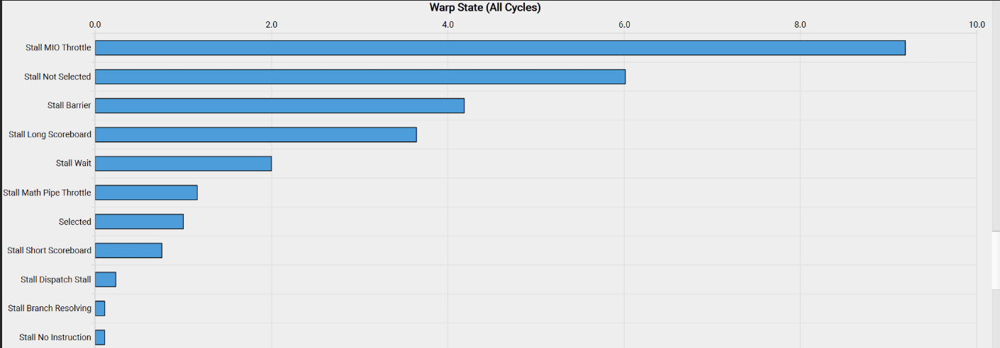
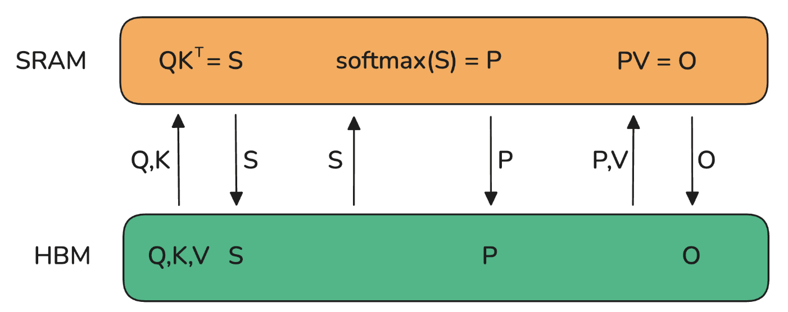
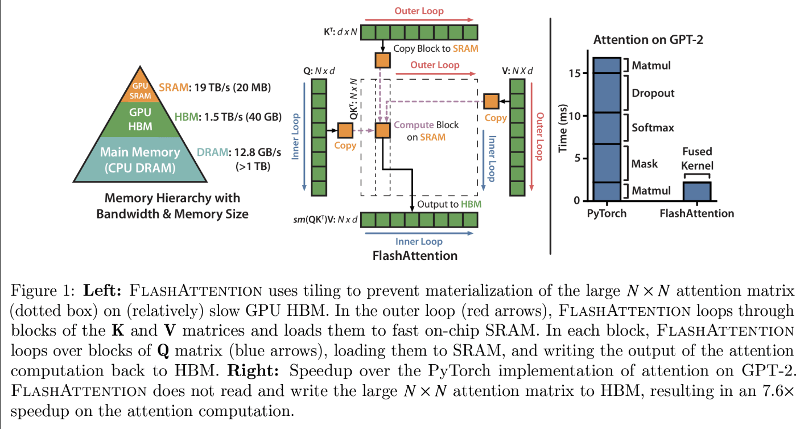

# Stolen Training Knowledge
The knowledge is **ALL stolen** from https://huggingface.co/spaces/nanotron/ultrascale-playbook?section=landmark_llm_scaling_papers .
## A primer on GPUs
Generally, GPUs have a very hierarchical organization. On the compute side, a GPU consists of an array of compute units called **streaming multiprocessors (SMs)**. Each SM contains and controls a set of **streaming processors**, also known as **cores**. For example, an NVIDIA H100 GPU has 132 SMs with 128 cores per SM, resulting in a total of 16,896 cores (see the docs for tensor cores for details), each capable of handling multiple threads simultaneously.

The memory side is also highly hierarchical, with several layers of cache and memory. **Registers** are the smallest units and are private to the threads during executions. **Shared memory and the L1 cache** are shared between the threads running on a **single SM**. Higher up is the **L2 cache shared by all SMs**, and finally there is the **global memory**, which is the largest memory on the GPU (the advertised 80 GB for an H100, for instance) but also the slowest to access and query.(L1&Shared Memory是SM内共享的，L2是所有SM共享的，global memory也应该是大家共享的，但是是最慢的、最大的～O(80)G)

### Kernels
The goal when using a GPU is to run as many workloads as possible, in parallel, on the available cores, by taking advantage of this hierarchical organization of compute/memory resources. A piece of code running on a **core** of the GPU is called a **kernel**(跑在cores上的一小片代码叫做kernel). It can be written at a high level in CUDA or Triton, for instance, and is then compiled to Parallel Thread Execution (PTX), the low-level assembly used by NVIDIA GPUs. To run the kernel you will also need some host code, which is executed on the CPU/host and takes care of preparing data allocations and loading data and code.

Kernels are generally scheduled as follows:
+ Threads are grouped in **warps**, each containing 32 threads(一段线程束包含32个线程). **All the threads in a warp are synchronized to execute instructions simultaneously** but on different parts of the data.（在一个线程束中，所有的线程按照单指令多线程（SIMT）方式执行，同时会被**同步**；也就是说，所有线程都执行相同的指令，但是每个线程在各自数据上进行操作，最后进行synchronization）
+ Warps are grouped in larger blocks of more flexible size (线程束被组合成block), with each block assigned to a single SM. An **SM may run several blocks in parallel**. However, depending on the resources available, not all of the blocks may get assigned for execution immediately; some may be waitlisted until more resources become available. (一个SM负责若干个block，每个block负责若干个warp，block之间是并行的)

## Improving performance with kernels
If you’re looking to add a new operation that lacks an optimized kernel or to speed up an existing PyTorch function, writing kernels from scratch might seem like the most direct route. However, creating high-performance CUDA kernels from scratch requires extensive experience, and there's a steep learning curve. Generally, a better way to get started is to leverage `torch.compile`, which dynamically optimizes PyTorch code by capturing your operations and generating lower-level, high-performance kernels in Triton. Let’s suppose you want to write a kernel for the Exponential Linear Unit (ELU) activation function. You can start by writing a simple PyTorch implementation, and then just add the @torch.compile decorator on top:

```python
@torch.compile
def elu(x, alpha=1.0):
    return torch.where(x < 0, alpha * (torch.exp(x) - 1), x) # 无法调用合适cuda进行直接优化（可能？），因为where里面的条件可以任意复杂
```

However, if this performance increase is insufficient, you can consider implementing Triton kernels. As a starting point, you can take a look at the Triton kernel generated by `@torch.compile`. To do so, you simply need to set the environment variable `export TORCH_LOGS="./output_code"`. Once you run the Python script with the `@torch.compile` decorator, it will generate and output the corresponding Triton kernel. Basically we can use following tricks:

+ PyTorch: easy but slow
+ @torch.compile: easy, fast, but not flexible
+ Triton: harder, faster, but more flexible
+ CUDA: hardest, fastest, and most flexible (if you get it right)

### Memory coalescing
Memory coalescing takes advantage of how DRAM delivers data in bursts whenever a memory address is accessed. Each time a DRAM location is accessed, a sequence of consecutive locations (including the requested one) is read in parallel by multiple sensors in the DRAM chip. Once read, this data can then be quickly transferred to the processor as a burst. In CUDA, coalescing uses this burst behavior to maximize memory access efficiency by ensuring that threads in a warp — a set of 32 threads that execute the same instruction in lockstep — access consecutive memory locations. For instance, if thread 0 accesses location M, thread 1 accesses M+1, thread 2 accesses M+2, and so forth, the GPU hardware coalesces or **combines these requests into one large**, efficient access request for the DRAM burst, rather than handling each access individually.

```C++
__global__ void matmul_naive(int M, int N, int K, const float *A, const float *B, float *C) {
    const uint x = blockIdx.x * blockDim.x + threadIdx.x;
    const uint y = blockIdx.y * blockDim.y + threadIdx.y;
    // check here
    if (x < M && y < N) {
        // calculation of C[x,y]
        float tmp = 0.0;
        for (int i = 0; i < K; ++i) {
            tmp += A[x * K + i] * B[i * N + y]; 
        }
        C[x * N + y] = tmp;
    }
}
```
`A`是`M*K`的矩阵，`B`是`K*N`的矩阵，结果`C`是`M*N`的矩阵。每个线程负责计算`C[x,y] == C[x * N + y]`中的结果（A，B，C在内存中都是连续的，所以只有一维的寻址）。对于`C[x,y]`，使用`A[x,:]`和`B[:,y]`，这部分在`for`循环中完成。`A,B,C`都是连续的内存，从`0`开始寻址。从

```C++
const uint x = blockIdx.x * blockDim.x + threadIdx.x;
const uint y = blockIdx.y * blockDim.y + threadIdx.y;
```
中我们可以看到，不同的线程依照其线程的`threadIdx.x threadIdx.y`(线程在线程块当中的局部位置)被赋予了不同的计算位置`x y`，从而执行同一个矩阵的并行。但是这个算法是有问题的。

However, when profiling this kernel with a tool like `ncu`, we can see issues, including low memory throughput and uncoalesced memory accesses. The reason for this is that in this kernel, two threads in the same block with thread IDs `(0, 0)` and `(1, 0)` (which will end up in the same warp) will both load from the same column of matrix `B` but **different rows of matrix `A`**. Since matrix elements are stored in row-major order (meaning row elements are in consecutive memory addresses), thread `(0, 0)` will load `A[0,0]` and thread `(1, 0)` will load `A[1,0]`in the first iteration when `i=0`. These elements are not stored close to each other in memory, and this misalignment will be present at each iteration, thereby preventing memory accesses from being coalesced. To improve the performance of our kernel, we can change the way coordinates `x` and `y` are calculated to the following:

```C++
const int x = blockIdx.x * BLOCKSIZE + (threadIdx.x / BLOCKSIZE);
const int y = blockIdx.y * BLOCKSIZE + (threadIdx.x % BLOCKSIZE);

if (x < M && y < N) {
float tmp = 0.0;
for (int i = 0; i < K; ++i) {
    tmp += A[x * K + i] * B[i * N + y];
}
C[x * N + y] = tmp;
}
```
Instead of using a 2D block, we switch to a 1D block and redefine how we determine the values of x and y. In this new method, threads within the same warp (which have close threadIdx.x values) will share the **same x value** but have **different y values**. This means that they will load the same row of matrix A but different columns of matrix B. **As a result, memory accesses can be coalesced for a row-major matrix**. 

> **Note:** 这段话的意思是，最开始的程序使用一个warp内的线程来计算C[x,y]，由于每个warp内`threadIdx.x threadIdx.y`是接近的，当整个warp被开始并行执行的时候，比如开始并发计算`C[0,0], C[1,0]`需要`A[0,:], A[1,:]`，这是完全不同的两个行，该warp需要fetch两次才可以完成计算。总的来说需要fetch `# of threads in a warp`次才能完成计算（因为每个warp负责完全不同的行列）。为了减少fetch数量，我们可以分割`A`，通过将`A`的一行分割成若干块，再去和做乘法，这样fetch数（memory accesses can be coalesced for a row-major matrix*）在并发到一个warp中就会减少。
### Tiling
Tiling is a technique that leverages shared memory to optimize memory access patterns. As we mentioned earlier, the shared memory on a GPU is a small, fast memory area accessible by all threads within a block. It allows data to be reused by multiple threads, reducing the need to repeatedly load data from the slower global memory.

In matrix multiplication, for example, each thread in a block may need elements from two matrices, say `A` and `B`. If each thread independently loads the row and column it needs from global memory, we'll end up with many redundant loads, as multiple threads in a block will access overlapping data. Instead, we can use tiling to load **a block (or "tile") of A and B into shared memory** just once, allowing all threads in that block to reuse the same shared data.

In the tiling approach, each iteration involves all threads within a block cooperatively loading two tiles — one from matrix A and another from matrix B — into shared memory. Specifically, the threads load a tile of matrix A (M * K) and a tile of matrix B (K * N). Once the tiles are in shared memory, the threads perform matrix multiplication on these tiles, enabling efficient computation since all the necessary data is quickly accessible. The results of the tile multiplication are stored in an accumulation matrix that holds intermediate results. After each iteration, the results from the current tile multiplication are added to this accumulation matrix, continuing until all tiles from both matrices have been processed.

### Thread coarsening
The tiling technique has significantly improved the performance of our kernel. However, when analyzing the warp states, which quantify how many cycles were spent in each state, we observe the following:



The meaning of these cryptic state names can be found in NVIDIA's Kernel Profiling Guide, in the "Warp Stall Reasons" section. There, we see that `smsp__pcsamp_warps_issue_stalled_mio_throttle` indicates <u>"Warp was stalled waiting for the **MIO (memory input/output)** instruction queue to be not full. This stall reason is high in cases of extreme utilization of the MIO pipelines, which include special math instructions, dynamic branches, as well as shared memory instructions. When caused by shared memory accesses, trying to use fewer but wider loads can reduce pipeline pressure."</u>

So it seems warps are stalling waiting for shared memory accesses to return! To solve this issue we can apply a technique called **thread coarsening**, which involves merging several threads into a single coarsened thread. This will significantly reduce shared memory accesses, as each coarsened thread can handle multiple output elements. Next, let's briefly go through a last important consideration when writing or improving custom kernels: minimizing control divergence.

### Minimizing control divergence
A streaming multiprocessor is built to execute all threads in a warp using the Single Instruction, Multiple Data (SIMD) model. This means that at any given moment, **one instruction is fetched and <u>executed simultaneously</u> for all threads within the warp**. When a warp is executed, the threads within it <u>operate on different segments of the data</u> but follow the same instruction (hence the name Single Instruction, Multiple Data). The primary advantage of SIMD is its efficiency: the control hardware responsible for instruction fetching and dispatching is shared among multiple execution units. This design minimizes the hardware overhead associated with control functions, allowing a greater portion of the hardware to focus on improving arithmetic throughput.

**Control divergence** occurs when threads within the same warp <u>take different execution paths</u>. For instance, if a conditional statement (like an if statement) leads to some threads executing one block of code while others execute a different block, the warp **must serialize these executions**, resulting in idle threads waiting for others to complete. To minimize control divergence, we need to design kernels to ensure that threads within the same warp follow the same execution path. This can be achieved by restructuring code to reduce branching, using data structures that ensure all threads follow similar execution paths, or employing techniques such as predication.

We have covered some of the main considerations when writing custom kernels and improving the performance and memory footprint of GPU operations. But there’s one more important concept to consider before we move to a real example: fusing kernels.
## Fused kernels
In several places now, we’ve mentioned how GPU and CPU operation can be asynchronous. **In particular, the host code on the CPU can schedule workloads on the GPU in a <u>non-blocking</u> way**. This can be useful for overlapping communication and computation – as we've seen many times in our journey – but it can also be extended to the more general idea of trying to avoid, at all cost, going back and forth between host and GPU kernel commands.

How can we avoid the back and forth shown on the left(global memory向compute cores输送数据，后者计算完成后返回到global memory，直到数据经过多次计算完成处理)? Well, the best way is to make our GPU as autonomous as possible. This is achieved by packing as many successive compute operations as possible together in a single kernel for the GPU to run, called a “fused kernel,” as shown on the right(global memory向compute cores输送数据，后者直接完成多步处理后将最终计算完成后返回到global memory).

Fused kernels are especially efficient and simple to write for successions of point-like operations that are performed independently of each other on each input token. In this case, there is no point in sending the computed values back to global memory before moving them to **SM memory** and spinning up a new kernel. It's much more efficient to keep all the values locally until all the computations have been performed.

In a Transformer model, this "fusing" approach can be applied every time we have a succession of point-wise operations, such as in the computations involved in the **LayerNorm layers**. We now have all the understanding necessary to marvel at a true masterpiece of kernel engineering: FlashAttention.
## FlashAttention
**<u>The idea behind FlashAttention is to make efficient use of the various memories of the GPU to avoid relying too much on the slowest one: the global memory</u>**. The lobal memory in modern GPUs often uses a technology called **High Bandwidth Memory (HBM)**, which despite its name, is slower than **SRAM** in the GPU memory hierarchy. This HBM terminology will be important when we discuss the details of FlashAttention's implementation.

A basic implementation of the attention mechanism involves a lot of transfer between memory and workers. It requires materializing the S matrix (where S = QK^T, the attention scores) and the P matrix (where P = softmax(S), the normalized attention weights) in HBM, which means that the results need to be sent to HBM and then back to SRAM for the next computations:


Since bandwidth is much lower in HBM, this introduces a severe bottleneck in the attention computation. The key element here is to compute the S matrix in small pieces that can fit in the smaller shared memory of the SM. But we can do even better and avoid materializing the very large S matrix altogether, in favor of keeping only the necessary statistics for computing the normalization factor of the softmax. So, we can compute part of `O` directly in one computation in SRAM rather than moving intermediate results back and forth. In this case, not only do we make use of the shared memory, but we also release the memory bottleneck resulting from materializing one of the largest activation matrices in the model (at long context length): the attention matrix.


he idea of FlashAttention resolves so many bottlenecks in model training that it has quickly become the default way to perform attention in all transformers. Notably:

+ By avoiding materializing the S matrix, we reduce the memory burden of attention. (在线计算，在线合并，无需保留全体)
+ We also remove a large part of the naive impact of the $O(S^2)$ cost of attention. （加速计算）

All variants of linear attention and subquadratic approaches to approximate attention (developed shortly after the invention of the Transformer architecture) have mostly been put aside in favor of this exact and fast FlashAttention implementation and mechanism. Following FlashAttention-1, two successive improved versions were released by the same lab: FlashAttention-2 and -3. In comparison to FlashAttention-1, the improvements in FlashAttention-2 and -3 are less about the general attention mechanism and more about tailoring its low-level implementation more specifically to the GPU by
+ (1) reducing the number of non-matmul operations as much as possible, 
+ (2) carefully partitioning the workload among wraps and thread blocks (for FlashAttention-2), and 
+ (3) carefully optimizing for FP8 and Tensor Core support on the latest Hopper (H100) architecture for FlashAttention-3

**FlashAttention is a master demonstration of the breakthrough improvements that can come when you <u>take into account the internal memory/compute design of current GPU accelerators</u>.**


# Finding the Best Training Configuration

## Step 1: Fitting a training step in memory
First, we need to figure out how we can fit a full model instance on our GPUs. There are two general cases:

1. GPU-rich
+ For models under 10B: single parallelism technique, e.g. TP or ZeRO-3/DP with full recompute across 8 GPUs.
+ For models between 10B-100B: parameters requiring more than 8 GPUs, you have several options: (1)Combining TP=8 with PP. (2)Combining TP=8 with DP (3)Using only ZeRO-3
+ At 512+ GPU scale, pure DP/ZeRO-3 will start to becomes **inefficient** due to communication cost. It can be better to then combine DP with either TP/PP.

We focus on fitting a single instance for now - even though we may use DP for ZeRO to achieve this goal - we're only interested here in the model parameters memory savings that it provide when used with ZeRO-3.

Special considerations:

+ For very long sequences, add CP across nodes.
+ For Mixture of Experts architectures, use EP across nodes.
  
2. GPU-poor
+ Full activation recomputation
+ Gradient accumulation
  
## Step 2: Achieving the target global batch size
To increase our current global batch size:
+ Scale up DP or gradient accumulation steps.
+ For long sequences, we can leverage CP.


To decrease our current global batch size:
+ Reduce DP in favor of other parallelization strategies.
+ For long sequences, reduce CP.
  
## Step 3: Optimizing training throughput(Is your training efficient?)
We want to make sure the training is running as fast as possible so all our precious GPUs are well utilized at all times. **As long as memory and communication aren't bottlenecks**, we can try the following:

+ Scale up TP (using the fast intra-node bandwidth) until we reach a degree close to the node size, so that we can reduce other forms of parallelism.
+ Increase DP with ZeRO-3 while keeping the target batch size.
<u>When data parallelism communication starts to become a bottleneck</u>, transition to using PP. Try scaling up different parallelisms <u>one by one</u>. Experiment with micro-batch sizes to aim for an optimal balance between max global batch size, model size, compute, and communication.

## Benchmarking thousands of configurations

We actually ran benchmarks ourselves on several thousand distributed configurations, covering every model size we've discussed here as well as a very large number of cluster configurations (namely, 1-64 nodes of 8xH100s) in order to produce the results we've covered up to now in this book. We want to take this opportunity to apologize to our coworkers for blocking most of the science cluster, and in turn forgive any threats that may have been whispered. Now let's take a step back to gather and analyze the results of all our benchmarks and see if, beyond theory, we can actually discover using real-world data how various configurations fare against each other. All the following benchmarks were conducted with a sequence length of 4,096 and a global batch size of 1M tokens. We gathered all the top configurations for each model and cluster size and plotted them in the following heatmaps:


From this high-level visualization, we can draw several important insights:

+ First, as we increase the number of nodes (higher parallelism), we observe a decrease in efficiency. This effect is particularly pronounced for smaller models, which have a lower compute to model size ratio. While we might typically compensate for small model size by increasing the batch size, we're constrained by our global batch size limit of 1M.
+ Second, larger models present a different challenge. As model size increases, memory requirements grow substantially. This creates two scenarios with fewer nodes: either the model doesn't fit at all, or it fits but runs inefficiently due to operating near the GPU memory limits (see for instance the 80B parameter model training on 4 nodes).
+ Finally, our benchmarks show how performance heavily depends on implementation quality. When we first implemented both parallelism strategies, tensor parallelism outperformed pipeline parallelism. After optimizing our PP code, it became the faster option. Now that we're improving the communication overlap in our TP implementation, we expect it to regain the performance lead.

# Citations from the book
See citations.md .


